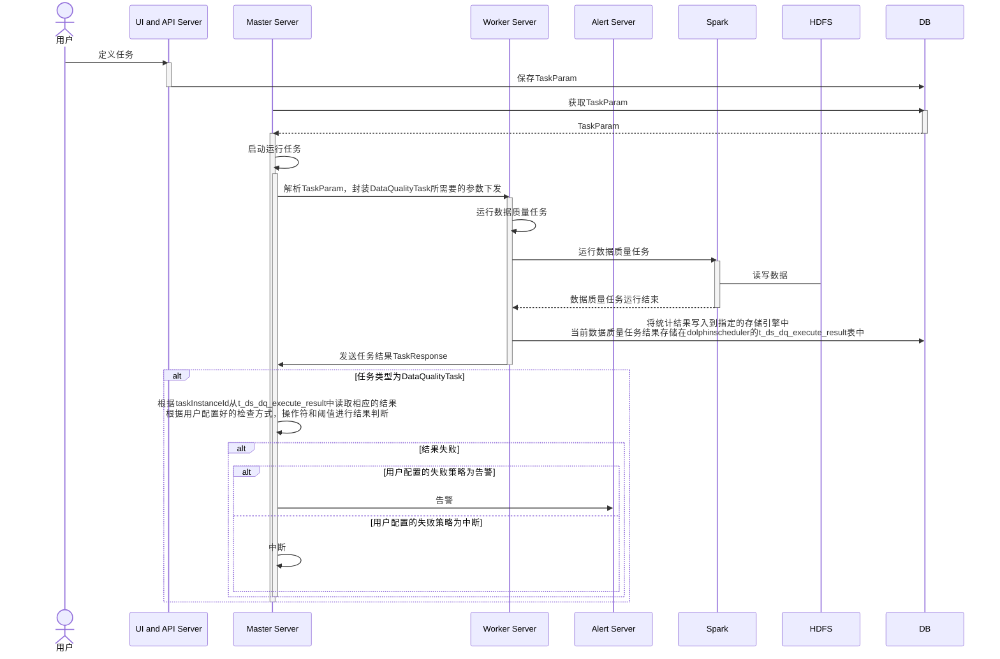

# 使用文档

<style>
  h1 {
    counter-reset: h2
  }
  h2 {
    counter-reset: h3
  }
  h3 {
    counter-reset: h4
  }
  h2:before {
    counter-increment: h2;
    content: counter(h2) ". "
  }
  h3:before {
    counter-increment: h3;
    content: counter(h2) "." counter(h3) ". "
  }
  h4:before {
    counter-increment: h4;
    content: counter(h2) "." counter(h3) "." counter(h4) ". "
  }
</style>

[TOC]

<br>

> base on dolphinscheduler-3.2.2

<br>

## 名词解释

| 名词 | 英文 | 解释 |
| --- | --- | --- |
| 租户 | Tenant | 租户对应的是Linux（部署机器的操作系统）的用户，用于worker（集群工作节点）提交作业所使用的用户。 |
| 用户 | User | 系统使用者，用户分为管理员用户和普通用户。 |
| 告警插件实例 | Alert Plugin Instance | 选择告警插件（Email、Telegram、DingTalk、WeChat、Webex Teams、Script、Http、Feishu、Slack等）创建告警实例。<br>在创建告警实例时，需要选择告警策略（成功发、失败发、成功和失败都发）。<br>创建告警组时，需要选择相应的告警实例。 |
| 告警组 | Alert Group | 告警组是在启动时设置的参数，在流程结束以后会将流程的状态和其他信息以邮件形式发送给告警组。 |
| 令牌 | Token | 令牌管理提供了一种可以通过调用接口的方式对系统进行各种操作。 |
| 数据源 | Data Source | 支持MySQL、POSTGRESQL、HIVE/IMPALA、SPARK、CLICKHOUSE、ORACLE、SQLSERVER等数据源。 |
| 项目 | Project | 用户的项目，项目包含工作流（流程）定义、工作流实例、工作流的任务节点。 |
| 工作流（流程） | Workflow（Process）| 为项目创建的工作流程。 |
| 任务 | Task | 工作流中的节点任务。 |

<br>

## 功能介绍

### 项目管理

### 任务类型

#### 默认任务参数

+ | 任务参数 | Parameter | API Request Param | 描述 |
  | --- | --- | --- | --- |
  | 任务名称 | Node Name | name | 任务的名称，同一个工作流定义中的节点名称不能重复。 |
  | 运行标志 | Run Flag | flag | 标识这个节点是否需要调度执行，如果不需要执行，可以打开禁止执行开关。 |
  | 缓存执行 | Cache Execution | | 标识这个节点是否需要进行缓存，如果缓存，则对于相同标识（相同任务版本，相同任务定义，相同参数传入）的任务进行缓存，运行时若已经存在缓存过的任务时，不在重复执行，直接复用结果。|
  | 描述 | Description | description | 当前节点的功能描述。 |
  | 任务优先级 | Task Priority | taskPriority | worker线程数不足时，根据优先级从高到低依次执行任务，优先级一样时根据先到先得原则执行。 |
  | Worker分组 | Worker Group | workerGroup | 设置分组后，任务会被分配给worker组的机器机执行。若选择Default，则会随机选择一个worker执行。 |
  | 任务组名称 | Task Group Name | taskGroupId(ref taskGroupName) | 任务资源组，未配置则不生效。 |
  | 环境名称 | Environment Name | environmentCode(ref environmentName) | 配置任务执行的环境。 |
  | 失败重试次数 | Number of Failed Retries | failRetryTimes | 任务失败重新提交的次数，可以在下拉菜单中选择或者手动填充。 |
  | 失败重试间隔 | Failure Retry Interval | failRetryInterval | 任务失败重新提交任务的时间间隔，可以在下拉菜单中选择或者手动填充。 |
  | CPU配额 | CPU Quota | cpuQuota | 为执行的任务分配指定的CPU时间配额，单位为百分比，默认-1代表不限制，例如1个核心的CPU满载是100%，16个核心的是1600%。 |
  | 最大内存 | Max Memory | memoryMax | 为执行的任务分配指定的内存大小，超过会触发OOM被Kill同时不会进行自动重试，单位MB，默认-1代表不限制。 |
  | 超时告警 | Timeout Alarm | timeoutNotifyStrategy | 	设置超时告警、超时失败。当任务超过"超时时长"后，会发送告警邮件并且任务执行失败。 |
  | 资源 | Resources | resourceIds(ref resources) | 	任务执行时所需资源文件 |
  | 前置任务 | Predecessor Task | preTaskCode(ref preTask) | 设置当前任务的前置（上游）任务。 |
  | 延时执行时间 | Delayed Execution Time | delayTime | 任务延迟执行的时间，以分为单位 |

<br>

### 数据质量

> [数据质量概述](https://dolphinscheduler.apache.org/zh-cn/docs/3.2.2/guide/data-quality)

#### 执行逻辑



+ > 用户在界面定义任务，用户输入值保存在TaskParam中 运行任务时，Master会解析TaskParam，封装DataQualityTask所需要的参数下发至Worker。 Worker运行数据质量任务，数据质量任务在运行结束之后将统计结果写入到指定的存储引擎中，当前数据质量任务结果存储在dolphinscheduler的t_ds_dq_execute_result表中 Worker发送任务结果给Master，Master收到TaskResponse之后会判断任务类型是否为DataQualityTask，如果是的话会根据taskInstanceId从t_ds_dq_execute_result中读取相应的结果，然后根据用户配置好的检查方式，操作符和阈值进行结果判断，如果结果为失败的话，会根据用户配置好的的失败策略进行相应的操作，告警或者中断

<br>

#### 检查逻辑

+ ```java

    // 校验方式
    public enum CheckFormula {
        ExpectedMinusActual {
            // Expected - Actual
            public Number data(Number expected, Number actual) {
                return expected - actual;
            }
        },
        ActualMinusExpected {
            // Actual - Expected
            public Number data(Number expected, Number actual) {
                return actual - expected;
            }
        },
        ActualDividedByExpectedPercentage {
            // (Actual / Expected) x 100%
            public Number data(Number expected, Number actual) {
                Number ratio = actual / expected;
                return ratio * 100;
            }
        },
        DifferenceRatioPercentage {
            // (Expected - Actual) / Expected x 100%
            public Number data(Number expected, Number actual) {
                Number difference = expected - actual;
                Number ratio = difference / expected;
                return ratio * 100;
            }
        };

        public abstract Number data(Number expected, Number actual);
    }

    // 操作符
    public enum Operator {
        EQUAL {
            // 等于操作符
            public boolean compare(Number x, Number y) { return x == y; }
        },
        LESS_THAN {
            // 小于操作符
            public boolean compare(Number x, Number y) { return x < y; }
        },
        LESS_EQUAL {
            // 小于等于操作符
            public boolean compare(Number x, Number y) { return x <= y; }
        },
        GREATER_THAN {
            // 大于操作符
            public boolean compare(Number x, Number y) { return x > y; }
        },
        GREATER_EQUAL {
            // 大于等于操作符
            public boolean compare(Number x, Number y) { return x >= y; }
        },
        NOT_EQUAL {
            // 不等于操作符
            public boolean compare(Number x, Number y) { return x != y; }
        };

        public abstract boolean compare(Number x, Number y);
    }

    // 期望值
    public class ExpectedValue {
        private ExpectedValueType type;

        public ExpectedValue(ExpectedValueType type) {
            this.type = type;
        }

        public ExpectedValueType getValueType() {
            return type;
        }

        public Number getValue() {
            Number value;
            switch (this.type) {
                case ExpectedValueType.FixValue:
                    value = SomeClass.getFixValue();
                    break;
                case ExpectedValueType.DailyAvg:
                    value = SomeClass.getDailyAvg();
                    break;
                case ExpectedValueType.WeeklyAvg:
                    value = SomeClass.getWeeklyAvg();
                    break;
                case ExpectedValueType.MonthlyAvg:
                    value = SomeClass.getMonthlyAvg();
                    break;
                case ExpectedValueType.Last7DayAvg:
                    value = SomeClass.getLast7DayAvg();
                    break;
                case ExpectedValueType.Last30DayAvg:
                    value = SomeClass.getLast30DayAvg();
                    break;
                case ExpectedValueType.SrcTableTotalRows:
                    value = SomeClass.getSrcTableTotalRows();
                    break;
                case ExpectedValueType.argetTableTotalRows:
                    value = SomeClass.getTargetTableTotalRows();
                    break;
                default:
                    throw new InvalidArgumentException("Invalid expected value type");
            }

            return value;
        }

        // 期望值类型
        public enum ExpectedValueType {
            FixValue,               // 固定值
            DailyAvg,               // 日均值
            WeeklyAvg,              // 周均值
            MonthlyAvg,             // 月均值
            Last7DayAvg,            // 最近7天均值
            Last30DayAvg,           // 最近30天均值
            SrcTableTotalRows,      // 源表总行数
            TargetTableTotalRows    // 目标表总行数
        }
    }

    // 校验
    public class Check {
        CheckFormula checkFormula;
        Operator operator;
        ExpectedValue expectedValue;
        Number threshold;   // 阈值

        public Check(CheckFormula checkFormula, Operator operator, ExpectedValue expectedValue, Number threshold) {
            this.checkFormula = checkFormula;
            this.operator = operator;
            this.expectedValue = expectedValue;
            this.threshold = threshold;
        }

        // 校验公式
        public method(Number actualValue /* 实际值 */) {
            Number data;

            // 校验方式数据
            data = this.checkFormula.data(expectedValue.getValue(), actualValue);
            // [校验方式][操作符][阈值]
            if (operator.compare(data, this.threshold)) {
                // 结果为真，则表明数据不符合期望，执行失败策略
                SomeClass.executeFailureStrategy();
            }
        }
    }
    ```

<br>

## 缺陷列表

+ UI设置：数据质量任务（data quality task）——字段长度校验规则（field length check rule）——逻辑操作符（logic operator），保存失效